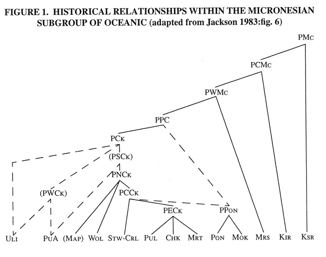
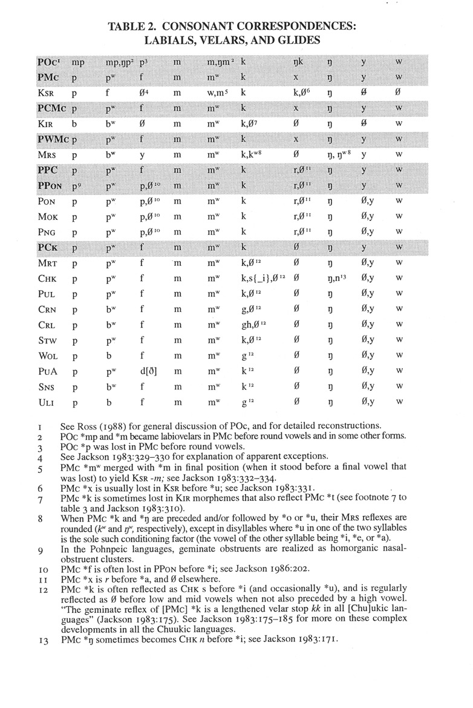
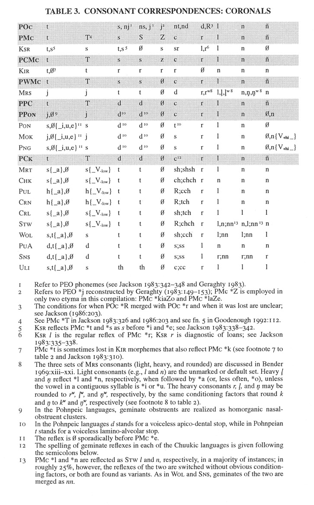

# Micronesian Comparative Dictionary

## How to cite

If you use these data please cite
- the original source
  > Byron W. Bender, Ward H. Goodenough, Frederick H. Jackson, Jeffrey C. Marck, Kenneth L. Rehg, Ho-min Sohn, Stephen Trussel, and Judith W. Wang. 2003. Proto-Micronesian Reconstructions—1. Oceanic Linguistics Vol. 42(1), 1-110, DOI: 10.2307/3623449
  > 
  > Byron W. Bender, Ward H. Goodenough, Frederick H. Jackson, Jeffrey C. Marck, Kenneth L. Rehg, Ho-min Sohn, Stephen Trussel, and Judith W. Wang. 2003. Proto-Micronesian Reconstructions—2. Oceanic Linguistics Vol. 42(2), 271-358, DOI: 10.2307/3623243
- the derived dataset using the DOI of the [particular released version](../../releases/) you were using

## Description

This dataset is licensed under a CC-BY-4.0 license

## Notes

The purpose of this dataset is to serve as longterm-accessible, machine readable and update-able version of the
Micronesian Comparative Dictionary, i.e. the data published as "Proto-Micronesian Reconstructions" in
Oceanic Linguistics in 2003.

The following introductory paragraphs are taken verbatim from the [MCD website](https://www.trussel2.com/MCD), where
Part 1 of the reconstructions was published online.

## INTRODUCTION

Lexical data for a number of Micronesian languages began to be collected systematically in the 
mid-1960s as part of the development of language lessons for the U.S. Peace Corps and in connection
with other Micronesian language projects that followed at the University of Hawai‘i. These data were 
stored on a mainframe computer using programs then being developed (Hsu and Peters 1984), and eventually 
dictionaries were published for a number of the languages included in this study (Elbert 1972, 
Abo et al. 1976, Lee 1976, Sohn and Tawerilmang 1976, Harrison and Albert 1977, Jensen 1977, 
Rehg and Sohl 1979, Goodenough and Sugita 1980, Jackson and Mark 1991). Comparative work using these 
data began with Marck 1977, focusing on the group of languages referred to as Nuclear Micronesian. 
In the next several years, the authors of the current study put the initial data on computer and 
substantially added to them by directly eliciting information from speakers of Micronesian languages 
who were students in the Bilingual Education Project for Micronesia at the University of Hawai‘i. 
Hsu (1976) was especially helpful in cognate searches. This early activity culminated in a printout 
identified as Bender et al. 1984. Preliminary findings and some of the computer programs being used 
in the comparative work are summarized in Bender and Wang 1985. More recent work and the initial 
compilation of this presentation of the data have been done primarily by the second author.

## CLASSIFICATION OF SUBGROUPINGS IN NUCLEAR MICRONESIAN

In this etymological dictionary we attribute to Proto-Micronesian (PMc) an inherited lexical item shared between a Chuukic or a Pohnpeic language, or Marshallese or Kiribati (Gilbertese), on the one hand, and Kosraean (Kusaiean), on the other. We have also attributed to PMc some lexical items in only one Micronesian language that are shared with some other Austronesian language and cannot be attributed to borrowing, although a systematic search for such items has not been made. Following Jackson (1983), we attribute to Proto–Central Micronesian (PCMc) items shared by Kiribati and any other Micronesian language lower in the tree of figure 1, but not found in any other Austronesian language, and we attribute to Proto–Western Micronesian (PWMc) items shared by Marshallese and any other language lower in the tree, but not found in any other Austronesian language. (Micronesian languages not shown in figure 1 include Sonsorolese [Sns] and Tobi [Tob] [which should be positioned on a par with PuA], the Tanapag dialect of Carolinian [Crn] [which should be included with Pul, Chk, and Mrt within PECk], and Pingelapese [Png] [which should be included with Pon and Mok under PPC]). Protoforms from all three languages—PMc, PCMc, and PWMc—are interspersed in a single alphabetized list in part 1 of this dictionary. Part 2 (in a future issue) will give protoforms for Proto-Chuukic (PCk), Proto–Pohnpeic (PPon), and Proto–Pohnpeic-Chuukic (PPC) for which no higher-level reconstructions are now possible. Consonant correspondences are given in tables 2 and 3. Vowel correspondences receive preliminary discussion in Jackson 1983:321–323 and Goodenough 1992.

Work for the future includes a careful review of evidence of loanwords from Marshallese and Kiribati not only in Kosraean but also in the Pohnpeic and Chuukic languages (see Rehg and Bender 1990). The seafaring atoll dwellers of the Marshall and Kiribati islands were frequent voyagers to the high islands of Kosrae and Pohnpei to their west. There were Polynesian-speaking settlers there as well—or at least there were Polynesian contacts—attested to by loanwords such as Pohnpeian sakaw (‘kava’ < Pn ta-kawa) and Sangaro (‘a god’ < Pn Tangaroa). There has been, moreover, massive borrowing into Kiribati from Samoan and to a lesser extent, more recently, from Tuvaluan. Kiribati speakers have expanded their settlements both southward into northern Tuvalu and northward into the southern Marshall Islands in the past few hundred years. Marshallese shows what are clearly loanwords from Kiribati (Bender 1981). Marck (1994) has reconstructed some Proto-Chuukic and even a few Proto-Micronesian forms where irregularities of sound correspondences raise the possibility that they result from a chain of borrowings rather than being inherited cognates. Such differences are noted under the forms in question. Complicating the problem are some forms that appear to be preserved as inherited cognates in some Micronesian languages and to have been reintroduced from them as loans into other Micronesian languages. Doublets, related forms such that one of them fits the pattern of sound correspondences in the inherited vocabulary and the other does not, attest to such internal borrowing as well. 

## ORTHOGRAPHIC SYMBOLS USED

In order to facilitate comparison, the velar nasal symbol (ŋ ) is used in the protolanguages PMc, POc, PCk, and UAn (Dempwolff’s Uraustronesisch), and in the nuclear languages being compared in lieu of the ng, g, §, and so forth used in their orthographies. The w of labiovelars in the various languages is made superscript, and this is substituted for the primes of p' and m' used by Marck (1977, 1994) and Jackson (1983). We use ñ to represent the palatal nasal of PPC, PMc, POc, and UAn; we use R to represent the retroflex continuant of Puluwatese, Crn Carolinian, and Satawalese, but otherwise as standardly used in PEO, POc, PMP or UAn, and PAn. We use á, é, ó, and ú to represent the low front unrounded, the mid central unrounded, the low back rounded, and the high central unrounded or rounded vowels of the various Chuukic languages. We use ε for the lax mid front vowel of Pohnpeian and Pingelapese; Mokilese e and ε are both written as e, following Harrison and Salich (1977). We use ɔ for the lax mid back rounded vowel that is written oa in all of the Pohnpeic languages. For Marshallese, we use the phonemic transcription of Abo et al. (1976), but substitute bʷ for b, mʷ for ṃ, ŋ for g, kʷ for q, and we use superscript w to show the rounding of ṃʷ, ŋʷ, ḷʷ, and rʷ. For Kosraean, we have rewritten the digraph vowels to make their phonetic value more transparent, as shown in table 1. Our orthography for POc is that of Ross (1988), to which we add S to his s. Our orthography for PCk is that of Jackson (1983), to which we add y. Our orthography for PMc is that of Jackson (1986), except that we substitute s for his d and S for his z, and we add y and Z. The symbol # marks an entry that we consider to be an analogical.

<table>
<tbody>
    <tr><td colspan="8" align="center">TABLE 1.	KOSRAEAN VOWEL SYMBOLS</td></tr>
    <tr>
        <th colspan="4">Lee 1976</th>
        <th colspan="4">our replacements</th></tr>
    <tr>
        <td>&nbsp;</td><td align="center">front</td><td align="center">central</td><td align="center">back</td>
        <td>&nbsp;</td><td align="center">front</td><td align="center">central</td><td align="center">back</td></tr>
    <tr>
        <td>high</td><td>i</td><td>ih</td><td>u</td>
        <td>high</td><td>i</td><td>ɨ</td><td>u</td></tr>
    <tr>
        <td>upper mid</td><td>e</td><td>uc</td><td>o</td>
        <td>upper mid</td><td>e</td><td>ə</td><td>o</td></tr>
    <tr>
        <td>lower mid</td><td>ac</td><td>uh</td><td>oh</td>
        <td>lower mid</td><td>ε</td><td>ʌ</td><td>ɔ</td></tr>
    <tr>
        <td>low</td><td>ah</td><td>a</td><td>oa</td>
        <td>low</td><td>æ</td><td>a</td><td>ɒ</td></tr>
</tbody>
</table>

## Statistics

- **Varieties:** 60 (linked to 50 different Glottocodes)
- **Concepts:** 12,211 (linked to 0 different Concepticon concept sets)
- **Lexemes:** 20,676
- **Sources:** 217
- **Synonymy:** 1.02
- **Cognacy:** 17,572 cognates in 1,706 cognate sets (26 singletons)
- **Cognate Diversity:** -1.24

## Possible Improvements:

- Entries missing sources: 1599/20676 (7.73%)

# Contributors

Name | GitHub user | Role
--- | --- | ---
Byron W. Bender | | author
Ward H. Goodenough | | author
Frederick H. Jackson | | author
Jeffrey C. Marck | | author
Kenneth L. Rehg | | author
Ho-min Sohn | | author
Stephen Trussel | | author
Judith W. Wang | | author
Robert Forkel | @xrotwang | DataCurator
Lev Blumenfeld | @lvblum | DataCurator

## CLDF Datasets

The following CLDF datasets are available in [cldf](cldf):

- CLDF [Wordlist](https://github.com/cldf/cldf/tree/master/modules/Wordlist) at [cldf/cldf-metadata.json](cldf/cldf-metadata.json)