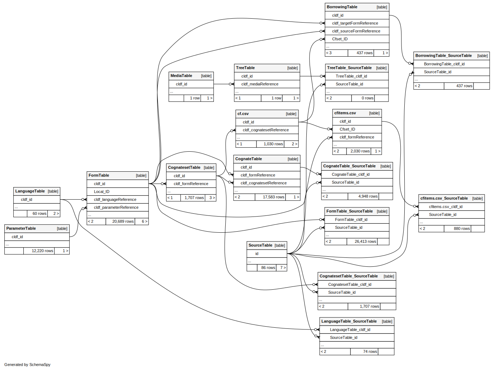

# Using the MCD CLDF data

As can be seen in the ERD (entity-relationship-diagram) below, the MCD data is quite relational.



To assemble the data of a reconstruction, as visualized on the [MCD website](https://trussel2.com/MCD/pmc-sets-a.htm),
one (minimally) needs to extract matching rows from
- the *CognatesetTable*
- the *CognateTable*
- the *FormTable*

But the [CLDF metadata](cldf/README.md) makes all relations transparent in a machine-readable format.
Thus, we recommend to access this data with tools which exploit this metadata. Below we describe three
ways in which to do that, each time using the reconstruction [PMc &ast;afara shoulder](https://trussel2.com/MCD/pmc-sets-a.htm#2982) as example.


## The `cldfbench etymdict.set` command

The `cldfbench` subcommand `etymdict.set` - provided by the `pyetymdict` package - can be used to visualize 
reconstructions of the MCD CLDF dataset
in the UNIX shell (aka the commandline). While the main purpose of this command was for quality control
during the process of parsing the HTML pages of the MCD website, it can now be used for quick, off-line, textual
searching of the MCD.

Below, we lookup the reconstruction *&ast;afara* by passing the form to the `cldfbench mcd.set` command:
```shell
$ cldfbench etymdict.set cldf --set afara

Proto-Micronesian *afara 'shoulder'

                                                                            ┌─yafara
                                                         ┌──────────────────┤
                                      ┌──────────────────┤                  └─
                   ┌──────────────────┤                  └─'hayer, hayeray'
──afara────────────┤                  └─
                   └─

Language               Form                              Meaning                                                 Source
---------------------  --------------------------------  ------------------------------------------------------  ---------------
Proto-Micronesian      *afara                            ‘shoulder’
Chuukese               afar, afara-(n)                   ‘shoulder, his shoulder’
Chuukese               (éwúw)-éfar                       ‘shoulder carrying pole’
Chuukese               (éwúw)-éfara                      ‘carry (something) on a pole’
Mortlockese            awúfar, awúfara-(n)               ‘shoulder’
Puluwatese             yefar                             ‘shoulder’
Puluwatese             yayéfar                           ‘shoulder, load carried on the shoulder’
Saipan Carolinian      aifar, aifár, ayúfar, aifara-(l)  ‘shoulder, carry a load on the shoulder, his shoulder’
Satawalese             efar, efara-(n)                   ‘shoulder’
Woleaian               yefare, yafera-(le)               ‘shoulder’
Pulo-Annan             yadala                            ‘shoulder’
Pulo-Annan             yadadala                          ‘carry on the shoulder’
Proto-Chuukic          *yafara                           ‘shoulder’
Pohnpeian              apɛrɛ                             ‘his shoulder’
Mokilese               aprɔ                              ‘his shoulder’
Pingilapese            apɛr                              ‘shoulder’
Marshallese            hayer, hayeray                    ‘shoulder’
Proto-Eastern Oceanic  *qafaRa                           ‘shoulder’                                              Geraghty (1990)
Proto-Oceanic          *qapaRa, qabaRa                   ‘shoulder’
Ulawan                 ‘apala                            ‘shoulder’
Proto-Kimbe            *[kq]apala                        ‘shoulder’
Proto-Austronesian     *qabaRa                           ‘shoulder’                                              Ross (1988)

There appears to have been corruption of the word for ‘shoulder carrying pole’ and its reinterpretation as ‘shoulder’ in Mortlockese, Puluwatese, and Saipan Carolinian.
```

## `pycldf`

The Python package `pycldf` allows programmatic access to CLDF data from the Python programming language.
In particular, it's `pycldf.orm` module provides an ORM (object-relational mapping) between dataset tables
and Python object which allow drilling down into related objects.

Thus, Python code to assemble the data could look as follows:
```python
>>> from pycldf import Dataset
>>> ds = Dataset.from_metadata('cldf/cldf-metadata.json')
>>> for cogset in ds.objects('CognatesetTable'):
...     if cogset.name == '*afara':
...         break
...         
>>> cogset
<pycldf.orm.Cognateset id="2982">
>>> cogset.related('formReference').language
<pycldf.orm.Language id="protomicronesian">
>>> cogs = [cog for cog in ds.objects('CognateTable') if cog.cognateset == cogset and not cog.form.language.data['Is_Proto']]
>>> len(cogs)
16
>>> cogs[0].form.cldf.value
'afar, afara-(n)'
>>> cogs[0].form.language
<pycldf.orm.Language id="chuukese">
```


## SQLite

While the Python API described above may be convenient, it is quite slow (and generally trades performance
for convenience) - and only available for Python. But each CLDF dataset can be converted to a SQLite database,
again exploiting the relations described in the metadata. Since SQLite databases can be accessed from virtually
all computing platforms (e.g. using RSQLite in R or sqlite3 on the UNIX shell), this provides somewhat universal
access to the data using SQL to describe how to select data from multiple tables.

Thus, a query to collect the reflexes for our example reconstruction could look as follows:
```sql
select
    f.cldf_value, l.cldf_name 
from cognatetable as c 
join formtable as f 
     on c.cldf_formReference = f.cldf_id 
join languagetable as l 
     on f.cldf_languageReference = l.cldf_id 
join cognatesettable as cs 
     on c.cldf_cognatesetreference = cs.cldf_id 
where cs.cldf_name = '*afara' and not l.is_proto;
```
resulting in

form | language
--- | ---
afar, afara-(n)|Chuukese
(éwúw)-éfar|Chuukese
(éwúw)-éfara|Chuukese
awúfar, awúfara-(n)|Mortlockese
yefar|Puluwatese
yayéfar|Puluwatese
aifar, aifár, ayúfar, aifara-(l)|Saipan Carolinian
efar, efara-(n)|Satawalese
yefare, yafera-(le)|Woleaian
yadala|Pulo-Annan
yadadala|Pulo-Annan
apɛrɛ|Pohnpeian
aprɔ|Mokilese
apɛr|Pingilapese
hayer, hayeray|Marshallese
‘apala|Ulawan

when run, e.g. using sqlite3.
